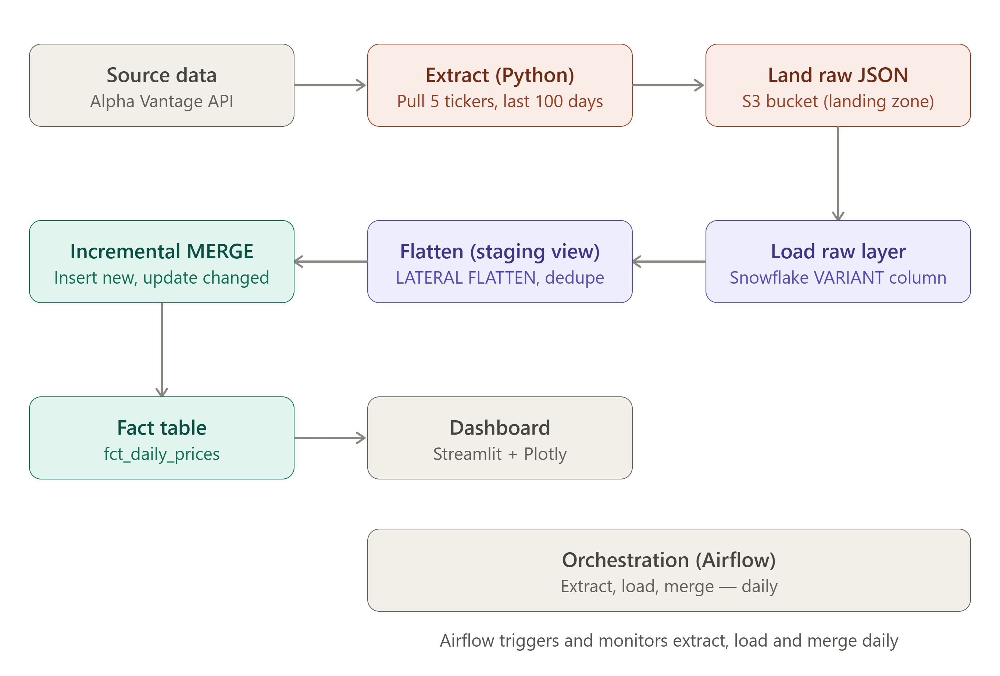

# Stock Data ETL Pipeline

An incremental data engineering pipeline: daily stock price data → cloud storage → data warehouse → merged fact table → orchestrated daily runs → live dashboard.

Built as a second, deliberately different portfolio project — same Data Engineering fundamentals as the [Sales Data ETL Pipeline](../sales-de-pipeline), but a different cloud (AWS instead of GCP), a different warehouse (Snowflake instead of BigQuery), and — most importantly — a genuinely **incremental** load pattern instead of full-refresh.

---

## What it does

Pulls daily price data for 5 tickers (AAPL, MSFT, GOOGL, AMZN, TSLA) from the Alpha Vantage API, lands the raw JSON in S3, loads it into Snowflake, and **merges** it into a clean fact table — only inserting new trading days and updating rows where the source data actually changed, never blindly reprocessing everything.

```
Alpha Vantage API → S3 (raw JSON) → Snowflake (raw layer) → MERGE → Snowflake (fact table) → Streamlit dashboard
```

Orchestrated daily via Airflow, running alongside the Sales Data Pipeline in the same Docker Airflow instance.

## Architecture



| Stage | Tool | What happens |
|---|---|---|
| Extract | Python | Calls Alpha Vantage for 5 tickers, lands raw JSON responses in S3, partitioned by ingestion date |
| Load (raw) | Snowflake `COPY INTO` | Loads raw JSON as-is into a `VARIANT` column — no parsing yet |
| Transform | Snowflake SQL (`LATERAL FLATTEN`) | Flattens nested daily price JSON into typed rows in a staging view |
| Load (incremental) | Snowflake `MERGE` | Inserts new trading days, updates only rows that actually changed, skips everything else |
| Orchestrate | Airflow (Docker) | Runs extract → load raw → merge as one daily DAG |
| Visualize | Streamlit + Plotly | Live Python dashboard querying the fact table directly |

## Why incremental, and why it matters

Alpha Vantage's free-tier `TIME_SERIES_DAILY` endpoint returns the **last 100 days on every call**, not just new data — so naive re-loading would create duplicates on every run. The pipeline handles this in two layers:

1. **A deduplicating staging view** (`QUALIFY ROW_NUMBER() ... ORDER BY ingested_at DESC`) collapses repeated raw ingestions of the same `(symbol, trade_date)` down to the most recent version.
2. **A `MERGE` statement** compares that clean staging data against the existing fact table — inserting genuinely new rows, updating rows where a value like `close_price` was revised, and leaving unchanged rows untouched.

Verified in practice: re-running the merge against unchanged data affects 0 rows; running it after a new trading day rolled in added exactly 5 new rows (one per ticker), with no duplicates.

## Tech stack

- **Python** — extraction and orchestration scripts
- **AWS S3** — raw data landing zone
- **Snowflake** — data warehouse, semi-structured JSON handling, incremental merge logic
- **Apache Airflow** (Docker) — daily orchestration
- **Streamlit + Plotly** — live dashboard

## Running it yourself

1. Get a free Alpha Vantage API key
2. Create an S3 bucket and IAM user with S3 access
3. Create a Snowflake trial account, a database/warehouse, and register an RSA key pair for key-pair authentication (password auth requires MFA and isn't suitable for scripts)
4. `pip install -r requirements.txt`
5. `python extract.py` → `python load_raw.py` → run the `MERGE` (via `load_and_merge.py`) for a manual first run
6. `streamlit run app.py` to view the dashboard locally
7. `cd airflow && docker-compose up -d` to run the full pipeline daily via Airflow

## Design decisions worth knowing

- **Key-pair authentication, not username/password** — Snowflake now requires MFA for password-based login on most accounts, which breaks non-interactive scripts. RSA key-pair auth is the standard approach for service/programmatic access.
- **Raw data stored as JSON (`VARIANT`), not pre-flattened** — keeps the raw layer a true, untouched mirror of the API response; all parsing happens downstream in the staging view, so a future API field change only requires updating one `LATERAL FLATTEN` query, not the load step.
- **Stage credentials embedded directly, not via a Storage Integration** — simpler for a portfolio project; in production, an IAM-role-based Storage Integration would avoid storing a long-lived secret in SQL.

## What I'd add next

- Switch Snowflake stage auth to a proper Storage Integration (IAM role instead of embedded keys)
- Deploy the Streamlit app (Streamlit Community Cloud) so the dashboard is live without needing to run it locally
- Add Slack/email alerting on Airflow task failure